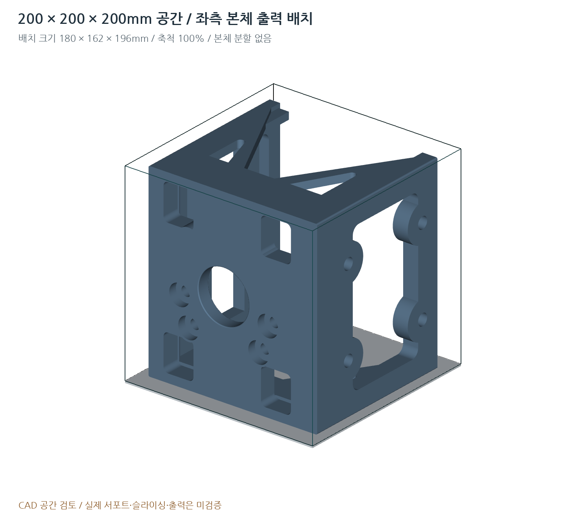

# 스마트카트 모터 브래킷 · Rev G / 0.7.0

학교 프린터의 **200 × 200 × 200 mm** 상한에 맞춘 폭 축소 개정. 본체는 **196 × 162 × 180 mm**, 좌우 각각 별도의 단일 솔리드이며 분할 접합 없이 한 개씩 출력함.



## 우선 사용할 파일

- 출력: `print/bed_ready/SCMB-G01-L-BED.stl`, `SCMB-G01-R-BED.stl` — 각각 1개. 배치 크기 **180 × 162 × 196 mm**.
- 받침: 같은 폴더의 `SCMB-G03-L-BED.stl`, `SCMB-G03-R-BED.stl` — 각각 1개. **176 × 105 × 41.430 mm**.
- SolidWorks: `cad/step/SCMB-G01-L.step` / `SCMB-G01-R.step`. 받침은 G03, 금속 참고부 포함 조립은 G10.
- FreeCAD: `cad/freecad/`의 같은 이름 FCStd. 빈 화면이면 루트 `OPEN_IN_FREECAD.FCMacro`로 BREP를 직접 가져와 네이티브 재저장.
- 도면: [설계도면](drawings/설계도면.pdf), [수정설명서](docs/수정설명서.pdf), 1:1 모터/차체 템플릿.

## Rev F 대비 변경

| 항목 | Rev F | Rev G |
|---|---:|---:|
| 본체 크기 | 212 × 162 × 180 | **196 × 162 × 180 mm** |
| 외곽 좌우 끝 | ±106 | ±98 mm |
| 상·하판 경량화 창 폭 | 170 | 154 mm |
| 전면 창의 좌우 중심 | ±78 | ±70 mm |
| 받침 레일 바깥/안쪽 좌표 | ±96 / ±84 | ±88 / ±76 mm |
| 핀 중심 X | ±90 | ±82 mm |
| 전방 모서리 기둥 깊이 | 30 | 28 mm |

단순 전체 축소를 하지 않음. 상판 M8×40 4개, 측면 M6×30 4개, 차체 중심간격90×100, 출력축 위치, 모터 각도L -45° / R135°, 8인치 기준 명목 지상고21.6 mm를 유지함. 상판16 / 측판18 / 하판12 / 거싯8 mm와 루트R10도 유지함.

## 출력 공간

회전 배치 STL의 본체 영역은 X10~190 / Y19~181 / Z0~196 mm. 200 mm 배드 중심에 한 부품씩 배치함. 5 mm 외곽 브림을 가정한 공간은 **190 × 172 mm**, 높이는196 mm임. 이는 기하학적 영역 계산이며 실제 서포트·퍼지라인·스커트·래프트·툴패스 검증이 아님. 외부 서포트가 이를 넘을 수 있으므로 학교 슬라이서 프로필에서 확인함. 래프트/두꺼운 받침을 추가하면 Z=200 mm 제한을 다시 확인함.

**100% 크기(mm) / 사용자가 요청한 100% 채움 설정.** STL에는 채움률이 저장되지 않음. 축소하여 맞춤 기능은 사용하지 않음. 기본 방향 STL도 최대196 mm라 200 mm 큐브 안에 들어가지만, 배드 회전본은 X/Y에 브림 여유를 더 확보한 배치임. 층간하중과 서포트는 실제 재료·출력 방향으로 재검토해야 함.

## 질량과 기하 검사

기존 밀도1.06 g/cm³ 입력을 유지한 CAD 계산: 본체 **1.193 kg/개**, 받침 **0.113 kg/개**, 플라스틱 좌우 합계 **2.611 kg**. 금속부·모터·서포트·브림은 제외함. Rev F 약2.800 kg 대비 약0.189 kg 감소함.

대리 모터 캔과 본체의 최소 기하 간격 **1.699 mm**. 조립 및 연속200 mm 삽입 경로 검사 **165개**, 출력공간·고정치수·실제홀축 검사 **68개** 통과. 모든 출력용 본체/받침의 STEP·STL 최대 치수를 검사함. 결과는 `qa/`에 있음.

**DEMO 형상 무간섭이 실물 맞춤이나 하중 안전을 보장하지 않음.** 모터 자료5쪽의 D01 외경·E02 편심·L04 보스·M01 귀 두께 등은 실측 대기 상태임. 외곽 폭을 줄여 주변 여유가 작아졌으므로 실측 대조가 특히 중요함. 21.6 mm 지상고는 타이어 눌림·구조 변형·바닥 요철을 차감하기 전의 명목값임.

## CAD 및 구조 검증의 한계

FCStd는 외부에서 직렬화한 `Part::Feature` 정밀 솔리드. 완전 구속 스케치·피처 이력은 아님. 형상 입력 치수의 재생성 원본은 `parameters.json`과 `src/geometry.py`임. `.SLDPRT`/`.SLDASM`/Simulation 프로젝트를 생성하지 않음. STEP는 정밀 솔리드 가져오기/직접 편집의 시작 형상임.

FreeCAD·SolidWorks 앱의 실제 화면/열기 검사는 미실시. 기존 BREP 직접 가져오기 매크로와 AP214 대안을 유지함. 매크로 역시 문법 검사만 실시함. **Rev G 구조 FEA·실물 출력·하중시험 미실시.** 단면/레일 위치 변경으로 기존 개정의 응력·변위·안전율을 전용하지 않음.

## 재생성

```bash
python -m pip install -r requirements.txt
python src/export_package.py
python src/check_design.py
python src/check_print_envelope.py
python src/render_preview.py
python src/render_print_bed.py
python src/write_docs.py
python src/make_drawings.py
python src/verify_package.py
python src/finalize_package.py
```

문서 생성에는 로컬 한국어 TTF가 필요함. Windows 맑은 고딕/리눅스 나눔고딕 또는 `FONT_KR`·`FONT_KR_BOLD` 환경변수를 사용함. 폰트 파일은 배포하지 않음. 치수를 바꾸면 구형 생성파일을 혼용하지 않고 전체 재생성함. 내보내기는200 mm 초과 시 중단함.

참조PDF2개·PNG1개는 `reference/`에 원본 유지. 자료에서 확정되지 않은 길이를 추측해 실측값으로 바꾸지 않음. 기준 저장소 커밋: `4792da580a78f302c24412488b0d653e7083863d` (Rev F). 원격 GitHub는 이 패키지로 수정하지 않았음.
